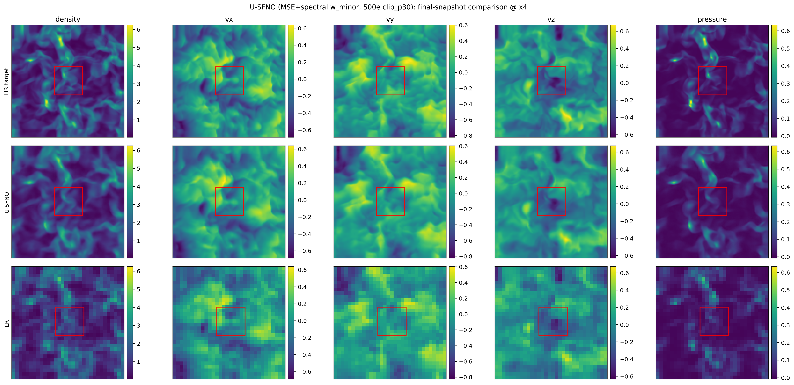
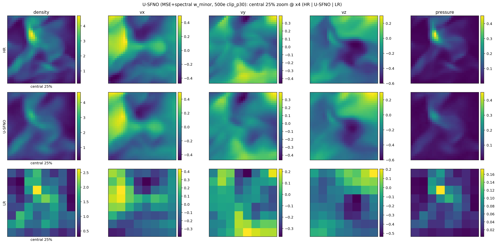

# super_resolution_turbulence_FNO

**Super-resolution of compressible turbulence with Fourier neural operators.**
Learns a 4× upsampling operator mapping low-resolution (32³) fluid states to
high-resolution (128³) ones. Training data is created with
[**astronomix**](https://github.com/leo1200/astronomix) (formerly jf1uids, a JAX Euler solver with
Kolmogorov-spectrum forcing). The ML side is entirely PyTorch. This work was done as a part of my Master Thesis for for the Astro AI group in Heidelberg IWR under Tobias Buck supervision. We provide the trained models in [HuggingFace](https://huggingface.co/javinukem/turbulence_sr)

 (First row is the target, second superresolved and third the original res)



## Implemented models

- **SFNO (`FNO_2`)**: Conv-lift → ResBlocks → upsample → FNO operator stack,
  with `upsample_factor` as a forward argument (variable-scale SR), after the
  arbitrary-resolution downscaling FNO of
  [Yang et al. 2023](https://arxiv.org/abs/2305.14452); the shifted Fourier
  modes implemented here are a novel contribution of this work.
- **USFNO**: operator blocks with a parallel 3-D U-Net path — the
  best-performing model (**MSE ×4 = 0.00529**, ~7.0× better than trilinear).
  Based on U-FNO ([Wen et al. 2021](https://arxiv.org/abs/2109.03697)); the
  shifted Fourier modes implemented here are a novel contribution of this
  work.
- **EDSR**: the purely-convolutional reference point, from
  [Lim et al. 2017](https://arxiv.org/abs/1707.02921).
- Physics-aware evaluation: per-channel MSE, velocity-norm/vorticity losses,
  1-D power-spectrum MSE, 3-D perceptual metric.

## Published models

Six published models (configs and loss curves under
`experiments/<experiment>/<model>/`, weights on [HuggingFace](https://huggingface.co/javinukem/turbulence_sr). 

| Model | Loss | MSE ×4 | Vorticity ×4 | Spectral ×4 |
|---|---|---|---|---|
| USFNO op=2 drop=0.1 | MSE + spectral | **0.00529** | **0.00064** | **0.01444** |
| SFNO MSE + light L1 | MSE + 0.062·L1 | 0.00799 | 0.00099 | 0.04671 |
| SFNO MSE only | MSE | 0.00808 | 0.00100 | 0.04987 |
| SFNO MSE + light spectral | MSE + 0.0064·spectral | 0.00820 | 0.00100 | 0.03274 |
| EDSR (skip on) | MSE | 0.00847 | 0.00107 | 0.06639 |
| Trilinear baseline | — | 0.03716 | 0.00284 | 0.21737 |

```bash
git clone https://github.com/javinukem/super_resolution_turbulence_FNO.git
cd super_resolution_turbulence_FNO
pip install -r requirements.txt
python model_acquire/download_weights.py   # fetch weights from HF into experiments/
```

> `autocvd` (GPU device pinning) and `Pylians` (physics metrics) are not plain
> PyPI installs — see `requirements.txt`.

## Usage

All commands run from the repo root (GPU scripts auto-select a free device
via `autocvd`).

```bash
# train an experiment (unified engine, declarative YAML run grid)
python -m src.training.training experiments/usfno/experiment.yaml
python -m src.training.training experiments/usfno/experiment.yaml --run usfno   # single run
python -m src.training.training --manifest <run-group dir>                     # eval-only

# benchmark a trained run group (omit --manifest to auto-discover the newest
# under $TURBULENCE_SR_SCRATCH)
python -m src.utils.benchmark --manifest <run-group dir>

# comparison bar chart (presets: edsr_norm_skip, comparing_best_models_mse,
# mse_loss_combinations; default output experiments/comparing_models_bar_chart_<preset>.png)
python -m src.plotting.comparing_models_bar_chart --preset mse_loss_combinations

# fetch published weights from HuggingFace (GPU not required)
python model_acquire/download_weights.py

# tests (GPU-free)
python -m pytest tests/ -v
```

## Data

HDF5 with keys `hr_states` `(N, 5, 128, 128, 128)` and `lr_states`
`(N, 5, 32, 32, 32)` (channels follow the astronomix primitive order
`[density, vx, vy, vz, pressure]`). The full dataset is 500 simulations ×
80 snapshots = 40 000 pairs (≈650 GB — not redistributed); regenerate it with
the astronomix-based script under `src/dataset/`.

All data/output locations resolve via environment variables with
repo-relative defaults (see `src/utils/paths.py`), so the repo runs on any
machine:

```bash
export TURBULENCE_SR_DATA=/path/to/h5_splits          # default: data/full_states_h5
export TURBULENCE_SR_SOURCE_DATA=/path/to/source_h5   # default: data/full_states_h5
export TURBULENCE_SR_SCRATCH=/path/to/run_groups      # default: runs/experiments
```

## Repository layout

```
experiments/        one folder per published experiment: experiment.yaml,
                    per-model config.yaml + loss_curve.png, benchmark CSVs,
                    comparison plots
model_acquire/      HuggingFace weight upload/download helpers
src/dataset/        lazy HDF5 dataset, simulation-level splitter, astronomix
                    data generation
src/losses/         MSE / spectral loss building blocks
src/model/          SFNO, USFNO, EDSR architectures and FNO layers
src/plotting/       bar-chart, snapshot and spectra comparison plots
src/training/       unified experiment trainer (declarative YAML run grids)
src/utils/          benchmark, model (re)loading, path resolution, calibration
tests/              GPU-free unittest suite
```

## Citation & license

See [`CITATION.cff`](CITATION.cff). Released under [MIT](LICENSE).
