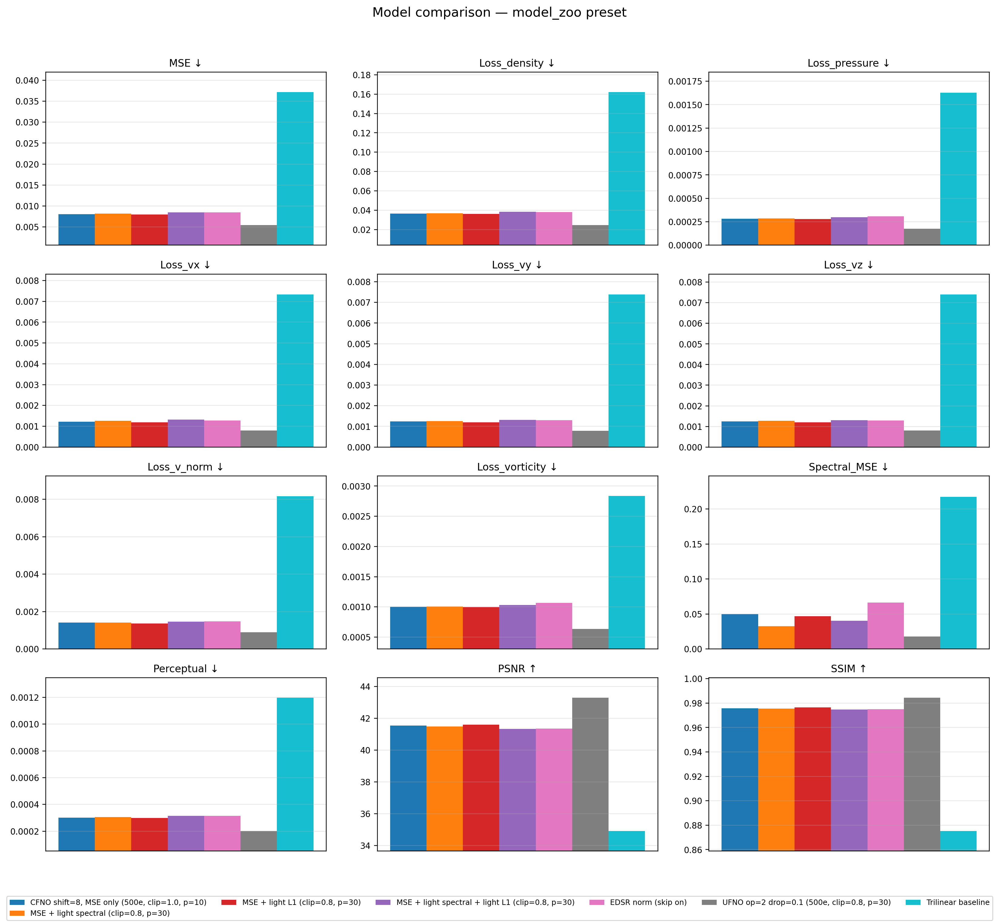

# turbulence_sr

**Super-resolution of compressible turbulence with Fourier neural operators.**
Learns a 4× upsampling operator mapping low-resolution (32³) fluid states to
high-resolution (128³) ones. Training data is synthesized with
[**jf1uids**](https://doi.org/10.5281/zenodo.15052815) (a JAX Euler solver with
Kolmogorov-spectrum forcing); the ML side is entirely PyTorch. States follow the
jf1uids primitive order `[density, vx, vy, vz, pressure]` (5 channels in 3-D).



## Highlights

- **CFNO (`FNO_2`)**: hybrid Conv-lift → ResBlocks → upsample → FNO-operator-stack
  architecture with a shifted-modes knob and optional trilinear skip connection;
  takes `upsample_factor` as a forward argument (variable-scale SR, evaluated at
  ×4 and ×2). ~33.7 M params.
- **UFNO**: each operator block additionally carries a parallel 3-D U-Net path —
  the best-performing model on the benchmark (**MSE ×4 = 0.00542**, ~6.9× lower
  than trilinear interpolation).
- **EDSR**: 3-D ConvNeXt-free adaptation of the image-SR classic (PixelShuffle3d
  upsampler), the purely-convolutional reference point.
- Physics-aware evaluation: per-channel MSE, velocity-norm/vorticity losses,
  1-D power-spectrum MSE (`Pk_library` + jf1uids unit conversion), a 3-D
  perceptual metric, PSNR, SSIM — plus a trilinear baseline.

## Model zoo

Six published models (configs + training records tracked here, weights on
HuggingFace). See [`model_zoo/README.md`](model_zoo/README.md) for the full
table and usage.

| Model | Loss | MSE ×4 | PSNR ×4 | SSIM ×4 |
|---|---|---|---|---|
| UFNO op=2 drop=0.1 | MSE + spectral | **0.00542** | **43.28** | **0.9843** |
| CFNO MSE + light L1 | MSE + 0.062·L1 | 0.00799 | 41.59 | 0.9765 |
| CFNO MSE only | MSE | 0.00808 | 41.55 | 0.9757 |
| CFNO MSE + light spectral | MSE + 0.0064·spectral | 0.00820 | 41.48 | 0.9756 |
| EDSR (skip on) | MSE | 0.00847 | 41.34 | 0.9751 |
| Trilinear baseline | — | 0.03716 | 34.92 | 0.8753 |

```bash
python scripts/download_weights.py   # fetch weights from HF into model_zoo/
```

## Installation

```bash
git clone https://github.com/javinukem/turbulence_sr.git
cd turbulence_sr
pip install -r requirements.txt
```

> `jf1uids` and `autocvd` are **not on PyPI** — install them from source first
> (only needed for dataset generation / physics metrics / GPU device pinning,
> not for the model-zoo eval path).

## Quickstart

**Evaluate a published model** (after `download_weights.py`, GPU required):

```bash
python evaluation/benchmark.py --manifest model_zoo
python evaluation/comparing_models_bar_chart.py --preset model_zoo \
    --output model_zoo/comparing_models_bar_chart_model_zoo.png
```

**Train a model** (Hydra; end-to-end presets compose model+data+training):

```bash
python train.py preset=dsfno     # or cnn, fno_2_2d, fno_2_exp4 (default: fno_1)
python train.py --cfg job        # compose config without running
```

Recent flagship experiments (CFNO/UFNO norm-on regime) are self-contained under
`experiments/<name>/` with a `run.sh` orchestrator — see
[`experiments/experiment_summary.md`](experiments/experiment_summary.md) and
[`experiments/MODELS.md`](experiments/MODELS.md) (full model catalog).

**Run the tests** (GPU-free smoke tests):

```bash
python -m pytest tests/ -v        # or: python -m unittest discover tests
```

## Data

Canonical format is HDF5 with keys `hr_states`, `lr_states`,
`first_snapshot_energy`, `first_snapshot_mass`:

| key | shape (3-D) | dtype |
|---|---|---|
| `hr_states` | `(N, 5, 128, 128, 128)` | float32 |
| `lr_states` | `(N, 5, 32, 32, 32)` | float32 |

The full dataset is 500 simulations × 80 snapshots = 40 000 pairs
(≈650 GB — not redistributed). To regenerate it, run the jf1uids-based scripts
under `src/dataset_generation/` (they read simulation parameters from the
legacy top-level `config.yaml`; see
[`data/dataset_specifications.md`](data/dataset_specifications.md) for the full
spec, split scheme, and RNG seeds).

## Repository layout

```
configs/            Hydra config tree (model/ data/ training/ runtime/ preset/)
data/               dataset spec, split script, RNG seeds (artifacts ignored)
docs/               per-experiment and per-model design notes
evaluation/         benchmark.py, manifest.py, comparing_models_bar_chart.py
experiments/        one folder per experiment (train scripts + aggregated results)
figures/            plotting scripts
model_zoo/          published models: configs, manifest, benchmark CSV (weights on HF)
notebooks/          exploratory notebooks (outputs stripped)
scripts/            download_weights.py
src/
  dataset_generation/  jf1uids (JAX) data synthesis — reads legacy config.yaml
  dataloader/          lazy HDF5 datasets
  model/               FNO_2/CFNO, UFNO_2, EDSR, DSFNO, FNO_1 (depracated/)
  training/            training loops
  utils/               pipeline.py (Hydra builders, save/load artifacts)
tests/              unittest smoke tests (pytest-compatible)
train.py            Hydra training entrypoint
```

## Known limitations

- **Two train/val split schemes coexist**: the Hydra pipeline splits
  *sample-level*; `data/split_dataset.py` splits *simulation-level*. Recent
  experiments use the simulation-level split. See
  `experiments/experiment_summary.md`.
- **The default Hydra preset (`fno_1`) lives in `depracated/`** — it is a live
  dependency, kept for backwards compatibility.
- **`n_operator_blocks ≥ 3` diverges** (NaN) across all FNO variants; all
  published configs cap it at 2.
- Some evaluation/training scripts carry **hardcoded cluster paths**
  (`/export/{data,scratch}/jalegria/...`); pass explicit `h5_path=` /
  `--manifest` arguments when running elsewhere.

## Citation

If you use this code, please cite it via the metadata in
[`CITATION.cff`](CITATION.cff).

## License

[MIT](LICENSE)
